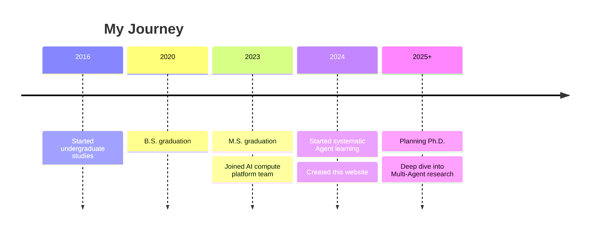

# About Me

## Introduction

I'm **Yulong Zhou**, a computer science practitioner currently working on **AI compute platforms**.

With both B.S. and M.S. degrees in Computer Science, I have a solid understanding of system architecture and distributed computing. Now, I aim to go further, deeper, and newer in the field of **AI Agents**, planning to pursue a Ph.D. focused on intelligent agent research.

## My Unique Perspective

**Compute Platform Background → Agent Research**

Unlike researchers with purely algorithmic backgrounds, I bring the following unique advantages:

1. **Engineering Implementation Skills**: Experienced in large-scale system architecture design and performance optimization
2. **Infrastructure Perspective**: Understanding the cost structure of model inference, able to optimize Agents at the system level
3. **Academic Potential**: Planning to pursue a Ph.D., systematically building research capabilities

## Research Interests

| Direction | Points of Interest | Current Status |
|-----------|-------------------|----------------|
| **Multi-Agent Systems** | Collaboration mechanisms, emergent behaviors, communication optimization | Systematically studying |
| **Agent Inference Efficiency** | Long-context optimization, inference acceleration, cost analysis | Combining existing experience |
| **Agent Safety & Alignment** | Interpretability, controllability, value alignment | Initial exploration |
| **Embodied AI** | Physical world interaction, sim-to-real transfer | Interested |

## Purpose of This Site

1. **Learning Documentation**: Systematically organize knowledge in the Agent field
2. **Research Accumulation**: Prepare for Ph.D. applications, develop academic writing skills
3. **Knowledge Sharing**: Exchange ideas with peers, build academic network
4. **Personal Branding**: Demonstrate technical depth and research potential

## Content Features

- **Source-level Analysis**: Not just using frameworks, but understanding principles
- **Reproduction-Driven**: Read papers, run code, encounter and solve problems
- **Open Thinking**: Pose open questions, document research ideas
- **Infrastructure Perspective**: View Agents through the lens of compute costs and system optimization

## Tech Stack

**Programming Languages**
- Python (Primary)
- C++ (Performance optimization)
- Go (Infrastructure)

**AI/ML**
- PyTorch
- Transformers
- LangChain / LlamaIndex
- vLLM / TensorRT-LLM

**Infrastructure**
- Kubernetes
- GPU Cluster Management
- Distributed Systems

## Contact

- **GitHub**: [@zhouyulong](https://github.com/zhouyulong)
- **Email**: [your-email@example.com](mailto:your-email@example.com)

## Timeline

---

*Welcome to connect, especially about Agent research, Ph.D. planning, and compute optimization topics.*
