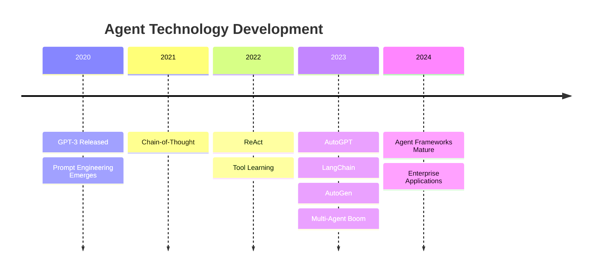

# Agent Evolution Tree

Under construction... This will showcase the complete evolution of Agent technology.

## Timeline

```mermaid
timeline
    title Agent Technology Development
    2020 : GPT-3 Released
         : Prompt Engineering Emerges
    2021 : Chain-of-Thought
    2022 : ReAct
         : Tool Learning
    2023 : AutoGPT
         : LangChain
         : AutoGen
         : Multi-Agent Boom
    2024 : Agent Frameworks Mature
         : Enterprise Applications
```

## Detailed Evolution Map

*Coming soon...*
