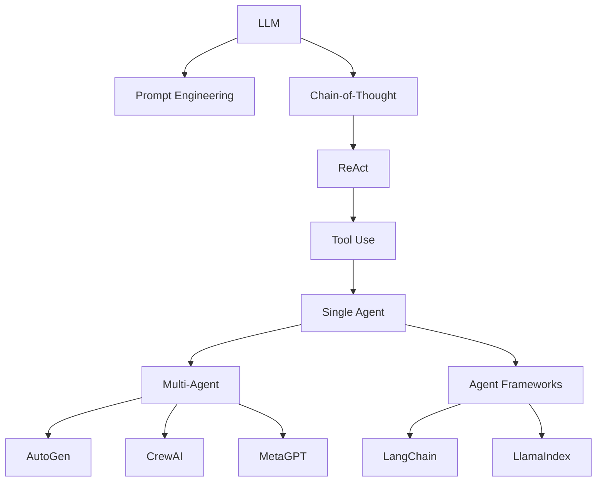

# Agent Lab

Welcome to the Agent Lab! This is where I document my hands-on practice, source code analysis, and reproduction notes on AI Agents.

## 🎯 Core Philosophy

> **"I hear and I forget. I see and I remember. I do and I understand."**
> —— Confucius

In the Agent field, hands-on practice is the best way to understand principles. This lab contains:

1. **Agent Evolution Tree** - Visual mapping of Agent technology development
2. **Reproduction Notes** - Complete records of paper/project reproduction (including failures)
3. **Hands-on Projects** - Building Agent systems from scratch

## 📊 Agent Evolution Tree

[View the complete Agent Evolution Tree →](/en/agent-lab/evolution-tree)

## 🧪 Experimental Projects

### In Progress

| Project | Description | Status | Link |
|---------|-------------|--------|------|
| Mini ReAct | Implementing ReAct from scratch | 🚧 In Progress | [GitHub](https://github.com/zhouyulong) |
| Multi-Agent Chat | Multi-Agent conversation system | 📋 Planned | - |

### Completed

| Project | Description | Takeaways | Link |
|---------|-------------|-----------|------|
| - | - | - | - |

## 📚 Reproduction Notes

### Paper Reproduction

| Paper | Conference | Status | Notes |
|-------|------------|--------|-------|
| ReAct: Synergizing Reasoning and Acting in Language Models | ICLR 2023 | 📋 Planned | - |
| AutoGen: Enabling Next-Gen LLM Applications | arXiv 2023 | 📋 Planned | - |

### Project Reproduction

| Project | Status | Notes |
|---------|--------|-------|
| - | - | - |

## 🔧 Toolbox

### Common Frameworks

- **LangChain** - Framework for building LLM applications
- **LlamaIndex** - Data-augmented LLM applications
- **AutoGen** - Microsoft's multi-Agent conversation framework
- **CrewAI** - Multi-Agent collaboration framework
- **MetaGPT** - Multi-Agent software development framework

### Self-developed Tools

| Tool | Description | Link |
|------|-------------|------|
| - | - | - |

## 📝 Methodology

### How to Learn a New Framework

1. **Quick Start**: Run official examples to build intuition
2. **Read Source Code**: Understand core abstractions and implementations
3. **Hands-on Modification**: Modify source code to verify understanding
4. **Independent Implementation**: Rewrite core functionality from scratch

### Reproduction Checklist

- [ ] Understand the paper's core contribution
- [ ] Find official code or third-party implementations
- [ ] Run the baseline
- [ ] Understand key code sections
- [ ] Try improvements or extensions
- [ ] Document problems and solutions

## 💡 Open Questions

- How to evaluate collaboration efficiency in Multi-Agent systems?
- How to optimize Agent inference costs?
- Impact of long context on Agent performance?

---

*Want to discuss a project? Feel free to contact me via [GitHub Issues](https://github.com/zhouyulong/zhouyulong.github.io/issues).*
