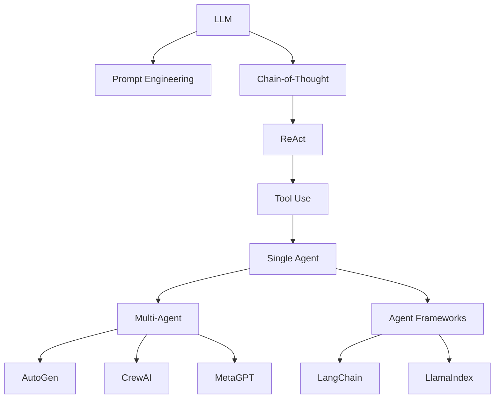

# Agent 实验室

欢迎来到 Agent 实验室！这里记录我对 AI Agent 的动手实践、源码分析和复现笔记。

## 🎯 核心理念

> **"I hear and I forget. I see and I remember. I do and I understand."**
> —— 孔子

在 Agent 领域，动手实践是理解原理的最佳方式。这个实验室包含：

1. **Agent 演化树** - 可视化梳理 Agent 技术发展历程
2. **复现笔记** - 论文/项目复现的完整记录（包括失败）
3. **动手项目** - 从零开始构建 Agent 系统

## 📊 Agent 演化树

[查看完整的 Agent 演化树 →](/knowledge/agent-evolution/)

## 🧪 实验项目

### 进行中

| 项目 | 描述 | 状态 | 链接 |
|------|------|------|------|
| Mini ReAct | 从零实现 ReAct 模式 | 🚧 进行中 | [GitHub](https://github.com/zhouyulong) |
| Multi-Agent Chat | 多 Agent 对话系统 | 📋 计划中 | - |

### 已完成

| 项目 | 描述 | 收获 | 链接 |
|------|------|------|------|
| - | - | - | - |

## 📚 复现笔记

### 论文复现

| 论文 | 会议 | 复现状态 | 笔记 |
|------|------|----------|------|
| ReAct: Synergizing Reasoning and Acting in Language Models | ICLR 2023 | 📋 计划中 | - |
| AutoGen: Enabling Next-Gen LLM Applications | arXiv 2023 | 📋 计划中 | - |

### 项目复现

| 项目 | 复现状态 | 笔记 |
|------|----------|------|
| - | - | - |

## 🔧 工具箱

### 常用框架

- **LangChain** - 构建 LLM 应用的框架
- **LlamaIndex** - 数据增强的 LLM 应用
- **AutoGen** - 微软的多 Agent 对话框架
- **CrewAI** - 多 Agent 协作框架
- **MetaGPT** - 多 Agent 软件开发框架

### 自研工具

| 工具 | 描述 | 链接 |
|------|------|------|
| - | - | - |

## 📝 方法论

### 如何学习一个新框架

1. **快速上手**：跑通官方示例，建立直觉
2. **阅读源码**：理解核心抽象和实现
3. **动手改造**：修改源码，验证理解
4. **独立实现**：从零重写核心功能

### 复现 checklist

- [ ] 理解论文核心贡献
- [ ] 找到官方代码或第三方实现
- [ ] 跑通 baseline
- [ ] 理解关键代码
- [ ] 尝试改进或扩展
- [ ] 记录问题和解决方案

## 💡 开放问题

- 如何评估 Multi-Agent 系统的协作效率？
- Agent 的推理成本如何优化？
- 长上下文对 Agent 性能的影响？

---

*想要一起探讨某个项目？欢迎通过 [GitHub Issues](https://github.com/zhouyulong/zhouyulong.github.io/issues) 联系我。*
