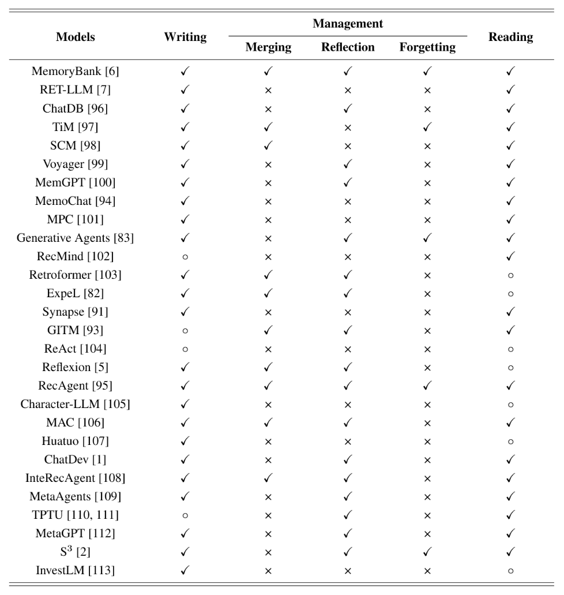

# A Survey on the Memory Mechanism of Large Language Model based Agents — 深度阅读笔记

> 本文是一篇关于大语言模型（LLM）智能体记忆机制的综述性论文，系统梳理了 Agent Memory 的定义、来源、形式、操作、评估方法及应用场景。
> 阅读时间：2026-04-15
> 关联方向：Agent 记忆机制、长期上下文建模、智能体自我进化

---

## 摘要

### 原文核心

该综述从认知心理学和自我进化的动机出发，将 Agent Memory 定义为支撑智能体在动态环境中积累经验、抽象知识并持续行动的核心模块。作者系统性地提出了一个统一框架：记忆写入（Writing）→ 记忆管理（Management）→ 记忆读取（Reading），并分别从记忆来源（Sources）、记忆形式（Forms）、记忆操作（Operations）和评估方法（Evaluation）四个维度对现有研究进行了分类与总结。

### 我的理解

这篇综述本质上是在回答三个问题：**为什么智能体需要记忆？记忆可以是什么形态？以及如何对记忆进行增删改查？** 它把散落在各类 Agent 论文中的记忆设计思路归纳成了一个可迁移的分析框架，对于后续设计或改进记忆模块非常有参考价值。

---

## 研究背景与问题

### 领域现状

当前 LLM-based Agent 的研究热点集中在推理能力、工具调用和多智能体协作上，但大多数工作将记忆视为简单的历史上下文拼接，缺乏对记忆机制本身的系统性思考。随着任务复杂度提升（如开放世界游戏、个人助手、社会模拟），智能体需要跨越多个 trial、整合外部知识、并从失败中学习，这要求记忆模块具备更强的结构化管理和长期演化能力。

### 核心问题

1. 如何形式化地定义 Agent Memory？
2. 记忆内容从何而来，应以何种形式存储？
3. 如何对记忆进行写入、管理（反思、合并、遗忘）和读取？
4. 如何客观评估记忆模块的有效性？

### 问题的重要性

记忆是智能体从“单次对话模型”进化为“可持续学习智能体”的关键。没有记忆，智能体每次交互都是独立事件，无法积累经验、形成个性或适应长期任务。

---

## 技术方案

### 整体架构

作者提出的统一演化函数：

$$
a_{t+1}^k = R\left(P\left(M_{t-1}^k, W(\{a_t^k, o_t^k\})\right), c_{t+1}^k\right)
$$

其中：
- $W$：记忆写入（Writing），将原始交互 $\{a_t^k, o_t^k\}$ 映射为记忆内容 $m_t^k$
- $P$：记忆管理（Management），对历史记忆 $M_{t-1}^k$ 和新记忆 $m_t^k$ 进行迭代处理
- $R$：记忆读取（Reading），根据当前上下文 $c_{t+1}^k$ 从记忆中检索相关信息
- 输出：支撑下一步动作 $a_{t+1}^k$

### 关键概念详解

#### Agent Memory 的两种定义

| 定义 | 范围 | 说明 |
|------|------|------|
| 狭义（Narrow） | 同一 trial 内的历史信息 | 即当前任务会话的上下文 |
| 广义（Broad） | 跨 trial 信息 + 外部知识 | 包括不同任务的历史、失败经验、用户偏好、知识库等 |

#### 记忆来源（Memory Sources）

1. **单次实验信息（Inside-trial）**：动态，支撑未来动作的最直接信息
2. **跨实验信息（Cross-trial）**：动态，积累经验（成功/失败）的关键
3. **外部信息（External）**：静态，缓解知识过时，拓展知识边界

#### 记忆形式（Memory Forms）

| 维度 | 文本记忆（Textual） | 参数记忆（Parametric） |
|------|---------------------|------------------------|
| 代表方法 | 原始交互、摘要、检索片段、外部知识 | 微调（Fine-tuning）、记忆编辑（Knowledge Editing） |
| 有效性 | 内容全面，但受上下文长度限制 | 不受上下文限制，但转换过程有信息损失 |
| 效率 | 写入快、读取慢（增加提示词长度） | 写入慢、读取快（隐式推理） |
| 可解释性 | 高 | 低 |
| 适用场景 | 近期交互、需要高可解释性 | 长期知识、大规模存储、熟悉领域 |

**文本记忆的研究重点**：
- 近期交互：基于时间截断，强调 recency
- 检索记忆：基于相关性/重要性/主题选择关键记忆
- 外部知识：将数据库、百科、知识库转化为记忆

**参数记忆的研究重点**：
- 微调：有监督训练，精度高，但易过拟合、灾难性遗忘、数据需求大、仅适用于离线
- 记忆编辑：针对特定事实进行小规模参数调整，不影响无关知识，成本低，适合在线场景

#### 记忆操作（Memory Operations）

1. **记忆写入（Writing）**
   - 核心问题：选择什么信息写入、如何表征
   - 策略差异：原始信息 vs. 摘要信息
   - 代表性工作：
     - SCM：设计记忆控制器，决定何时写入
     - MemGPT：由智能体自行控制记忆操作
     - MemoChat：总结对话主题片段，作为索引记忆的键值

2. **记忆管理（Management）**
   - **反思（Reflecting）**：生成高维度、抽象化的记忆，提升泛化能力
   - **合并（Merging）**：融合相似记忆，减少冗余
   - **遗忘（Forgetting）**：删除无用或不相关记忆，提升准确性

3. **记忆读取（Reading）**
   - 核心问题：如何获取与当前状态最相关的记忆
   - 代表性工作：
     - ChatDB：将记忆存储为数据库，通过 SQL 语句读取
     - MPC：从记忆池中检索相关记忆，提供思维链并忽略特定记忆
     - Expel：利用 FAISS 向量存储作为记忆池，获取相似度 Top-k 记忆

> 记忆读取与写入是协同的：文本记忆多采用文本相似度及辅助信息读取；参数记忆则通过更新后的参数进行隐式推理。

---

## 评估方法

### 直接评估（Direct Evaluation）

独立评测记忆模块本身的能力。

#### 主观评价
- **连贯性（Coherence）**：召回的记忆是否与当前上下文匹配且自然
- **合理性（Plausibility）**：召回的记忆内容是否正确、合理

#### 客观评价

| 维度 | 指标 | 说明 |
|------|------|------|
| 结果正确性 | $Correctness = \frac{1}{N}\sum_{i=1}^{N}\mathbb{I}[a_i = \hat{a}_i]$ | 基于记忆回答预设问题的准确率 |
| 引用准确性 | F1 = $2 \cdot \frac{Precision \cdot Recall}{Precision + Recall}$ | 评估检索到的记忆与标准答案的匹配程度 |
| 效率 | $\Delta time = \frac{1}{M}\sum_{i=1}^{M}(t_i^{end} - t_i^{start})$ | 记忆适配时间 + 推理时间 |

### 间接评估（Indirect Evaluation）

通过端到端任务验证记忆模块的价值：

1. **对话（Conversation）**：评估连贯性（Consistency）和参与度（Engagement）
2. **多源问答（Multi-source QA）**：检验整合任务内、跨任务和外部知识的能力
3. **长上下文应用（Long-context Applications）**：段落检索能力是重要指标

---

## 批判性思考

### 优点

1. **框架清晰**：将分散的记忆研究归纳为统一的“写入-管理-读取”流程，便于理解和迁移
2. **分类系统性强**：从来源、形式、操作到评估，覆盖了记忆机制设计的完整生命周期
3. **工程指导意义强**：文本记忆 vs. 参数记忆的对比分析，为实际系统选型提供了明确依据

### 局限与不足

1. **缺乏定量对比**：综述以定性分析为主，不同记忆方案在相同基准上的性能对比较少
2. **评估标准尚未统一**：直接评估和间接评估的指标多样，难以横向比较不同工作
3. **对多模态记忆涉及较少**：主要聚焦文本和参数形式，对图像、音频等多模态记忆的讨论有限

### 可改进的方向

1. 建立统一的 Agent Memory Benchmark，覆盖写入、管理、读取全链路
2. 探索文本记忆与参数记忆的混合架构，兼顾可解释性与长期存储能力
3. 研究记忆的时序衰减机制，动态平衡 recency、relevance 和 importance

---

## 与我工作的结合

### 可以直接借鉴的

- 在设计 Agent 系统时，优先采用“文本记忆 + 向量检索”处理近期交互，再视需求引入参数记忆处理长期知识
- 评估记忆模块时，可同时采用直接评估（引用准确率 F1）和间接评估（端到端任务成功率）

### 可以探索的研究问题

1. 如何在有限上下文窗口下，设计自适应的记忆压缩与摘要策略？
2. 参数记忆编辑技术（如 MEND）在在线 Agent 系统中的实时性和稳定性如何？

---

## 关键引用

| 序号 | 论文 | 贡献 |
|------|------|------|
| 1 | Generative Agents (Park et al., 2023) | 基于余弦相似度的关键记忆检索 |
| 2 | MemGPT (Packer et al., 2023) | 完全由智能体自我指导的记忆管理 |
| 3 | SCM (Liang et al., 2023) | 设计记忆控制器决定何时执行记忆操作 |
| 4 | ChatDB (Hu et al., 2023) | 将数据库作为智能体的符号化记忆 |
| 5 | Character-LLM (Shao et al., 2023) | 角色相关的微调方法 |
| 6 | MEND (Mitchell et al., 2021) | 利用元学习为预训练模型生成参数修改方案 |

---

## 版本记录

- v1.0 2026-04-15：基于原始笔记整理，完成综述性总结
