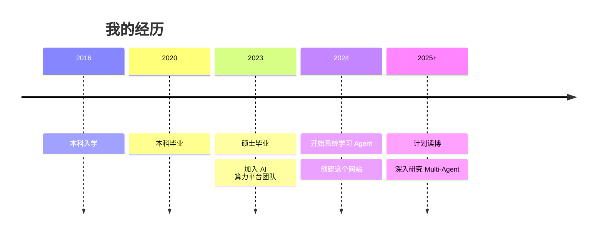

# 关于我

## 简介

我是**周玉龙**，一名计算机从业者，目前从事 **AI 算力平台**相关工作。

本科和硕士均就读于计算机专业，对系统架构和分布式计算有较为深入的理解。现在，我希望在 **AI Agent** 领域走得更远、更深、更新，计划未来攻读博士学位，专注于智能体相关研究。

## 我的独特视角

**算力平台背景 → Agent 研究**

不同于纯算法背景的研究者，我具备以下独特优势：

1. **工程实现能力**：熟悉大规模系统的架构设计与性能优化
2. **基础设施视角**：理解模型推理的成本结构，能从系统层面优化 Agent
3. **学术潜力**：有读博规划，正在系统积累研究能力

## 研究兴趣

| 方向 | 兴趣点 | 当前状态 |
|------|--------|----------|
| **Multi-Agent System** | 协作机制、涌现行为、通信优化 | 系统学习中 |
| **Agent 推理效率** | 长上下文优化、推理加速、成本分析 | 结合现有经验 |
| **Agent 安全与对齐** | 可解释性、可控性、价值对齐 | 初步了解 |
| **具身智能** | 与物理世界交互、仿真到现实迁移 | 感兴趣 |

## 这个网站的目的

1. **学习记录**：系统整理 Agent 领域的知识
2. **研究积累**：为读博做准备，培养学术写作能力
3. **知识分享**：与同行交流，建立学术网络
4. **个人品牌**：展示我的技术深度和研究潜力

## 内容特色

- **源码级分析**：不只是用框架，更要理解原理
- **复现驱动**：论文要读，代码要跑，坑要踩
- **开放思考**：提出开放性问题，记录研究想法
- **基础设施视角**：从算力成本、系统优化角度看 Agent

## 技能栈

**编程语言**
- Python（主要）
- C++（性能优化）
- Go（基础设施）

**AI/ML**
- PyTorch
- Transformers
- LangChain / LlamaIndex
- vLLM / TensorRT-LLM

**基础设施**
- Kubernetes
- GPU 集群管理
- 分布式系统

## 联系方式

- **GitHub**: [@zhouyulong](https://github.com/zhouyulong)
- **Email**: [your-email@example.com](mailto:your-email@example.com)
- **知乎**: [你的知乎主页]（可选）

## 时间线

---

*欢迎交流，特别是关于 Agent 研究、读博规划、算力优化等话题。*
